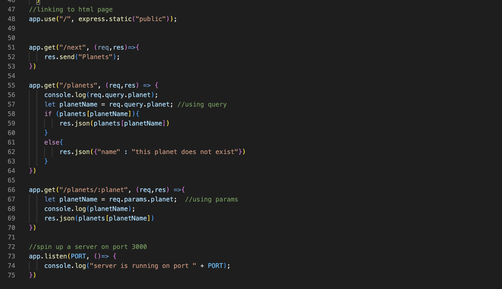
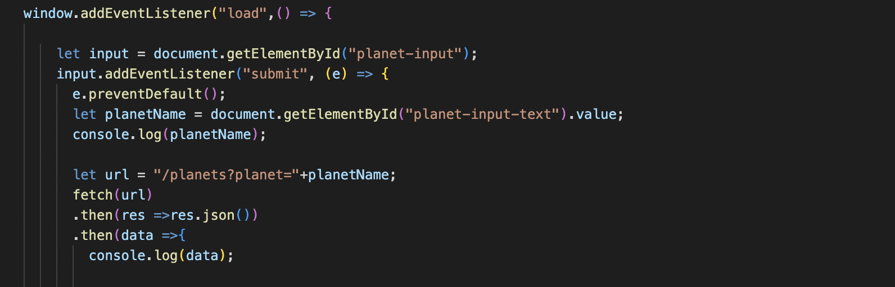
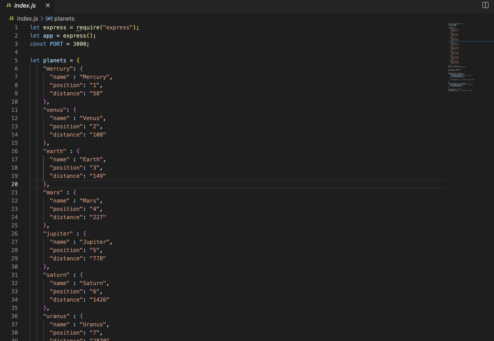
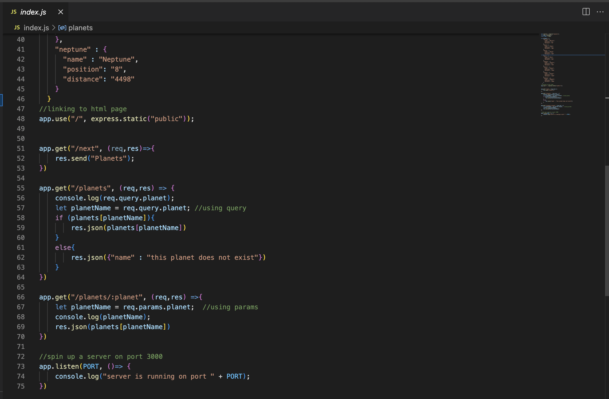
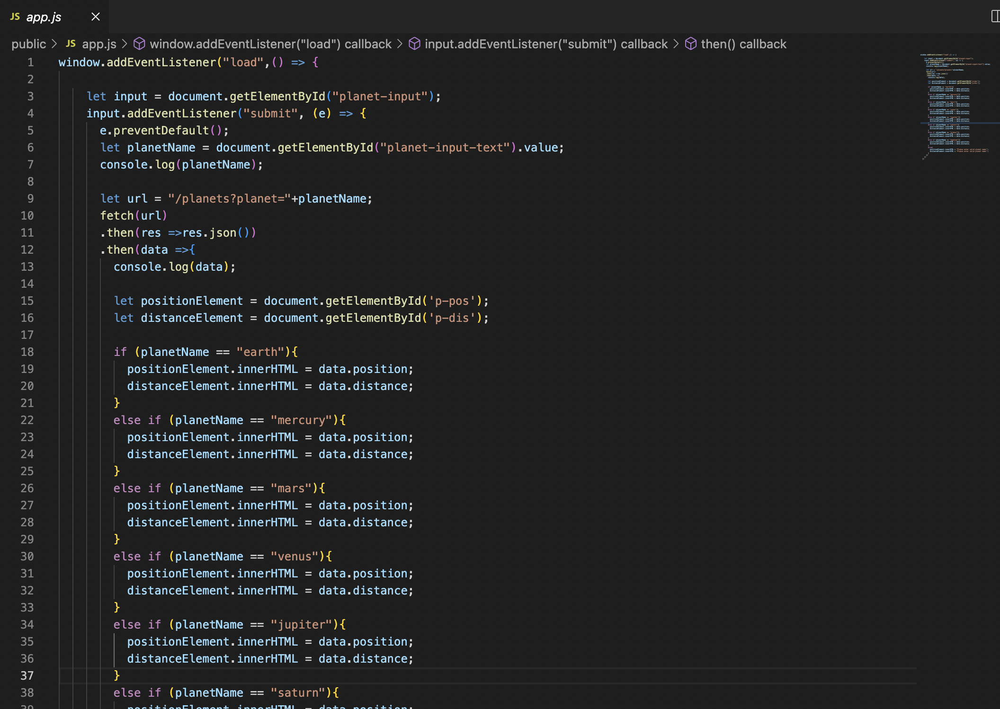
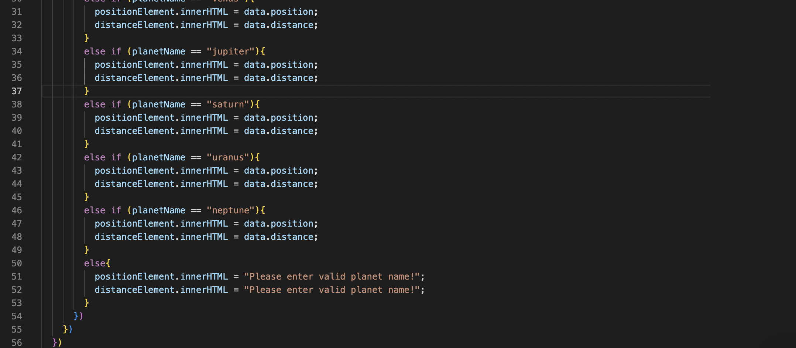

# Documentation of Assignment#4

## What I learned from this Assignment?

1) With the help of this project, I learned a lot about Node.js and creating your own servers. In practice, I used  let express = require(‘express’); code snipped  to bring express into the program.  
2) I created the routes for the server using let app = express();. I also learned how to manage server when a client is trying to GET information from the ‘/’ route.
3) I made server listen to the browser on port 3000 and respond according to client request. Learnt how to control responses, interpret requests and determine what exactly gets sent back to the server.

  
  
4) In addition I served JSON and made my own API  that can be used by others as well. I implemented multiple routes using req.params and query.
4) For Assignment 4 specifically I served a public static folder using code snippet - app.use('/', express.static('public')); and tied this together using the API to access it in my code using fetch. I know understand that we have 2 consoles: 1) front end console in the browser, and the servers in the terminal.

  

## Code index.js
  
  
  

## Code app.js
  
  
  

