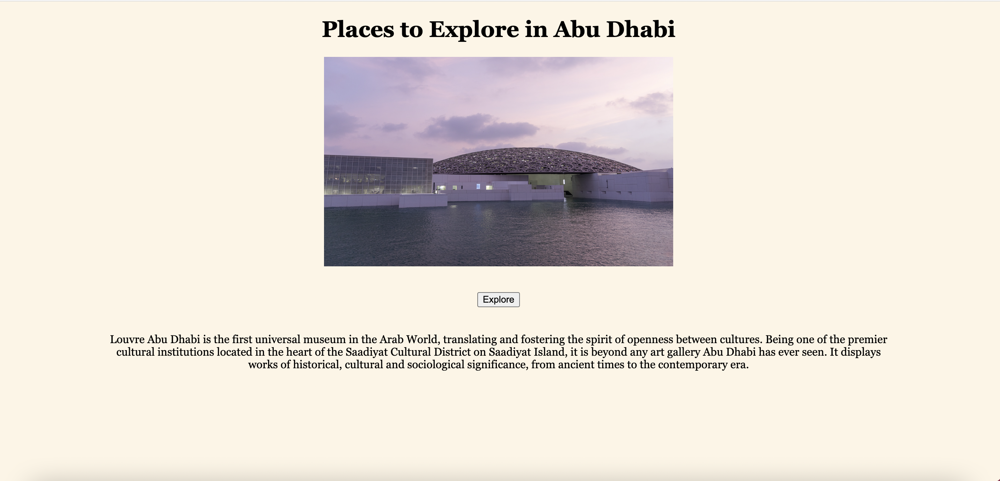
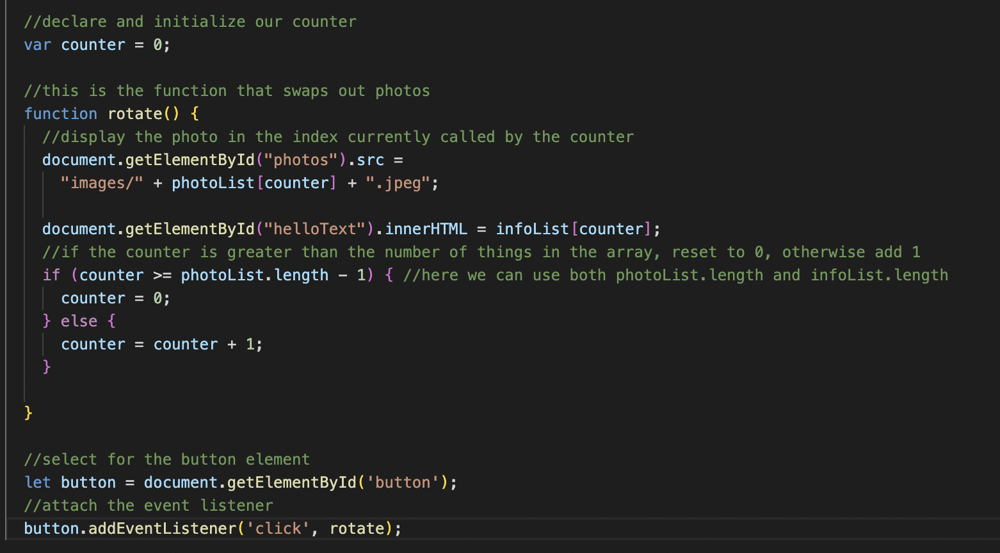

# Documentation of Assignment#3

## Website link: https://aibartt.github.io/Connection_Lab_Aibar/Assignments/Assignment%233/EventJS/

## Wireframe of Website: 

## What I learned from this Assignment?

With the help of this project, I learned a lot about Media queries - how can we make our website responsive. In practice, I used addEventListener() method for adding event handlers in web pages. The <button> element has an event called 'click' that fires when the user clicks the button. Objects that can fire events have an addEventListener() method. In my website I created image and text carousel of places to visit in Abu Dhabi using Even Arrays Images and Text. I did some progress on learning basics of JavaScript language, how to declare and initialize our variables, lists and etc. I also learned some Document Object Model (DOM) concepts and logic of accessing different parts of the website.
  
  I used one button element to create two event-driven user interactions that are handled in a script.js file. When the user clicks on the Explore Button, it depicts one of the tourist destinations in Abu Dhabi with a concise description, and when you click the button, it shows the following tourist destinations with its corresponding description.
  
  

## Code index.html
  
	  <!DOCTYPE html>
	<html lang = "en">
	<head>
		<meta charset="UTF-8">
		<meta http-equiv="X-UA-Compatible" conten="IE=edge">
		<meta name="viewport" content="width=device-width, initial-scale=1.0">
		<title>Campus Cats</title>
		<link rel="stylesheet" href="style.css">
	</head>
			<title>Explore Abu Dhabi</title>
		</head>
		<body>

		<h1>Places to Explore in Abu Dhabi</h1>
		<section class="container">
		    </img>
			      		    
		 </section>

		  
		<button id="button">Explore</button>

		<section>
		      
		    
Louvre Abu Dhabi is the first universal museum in the Arab World, translating and fostering the spirit of openness between cultures. Being one of the premier cultural institutions located in the heart of the Saadiyat Cultural District on Saadiyat Island, it is beyond any art gallery Abu Dhabi has ever seen. It displays works of historical, cultural and sociological significance, from ancient times to the contemporary era.

		</section>

			
		</body>
	</html>

## Code script.js

	//declare and initialize our list just like any other variable
	var photoList = [
	    "img1",
	    "img2",
	    "img3",
	    "img4",
	    "img5"
	  ];

	  let infoList =[
	    "Louvre Abu Dhabi is the first universal museum in the Arab World, translating and fostering the spirit of openness between cultures. Being one of the premier cultural institutions located in the heart of the Saadiyat Cultural District on Saadiyat Island, it is beyond any art gallery Abu Dhabi has ever seen. It displays works of historical, cultural and sociological significance, from ancient times to the contemporary era.",

	    "Abu Dhabi’s Sheikh Zayed Grand Mosque is one of the world’s largest mosques and an architectural masterpiece that beautifully combines Islamic architecture and design. Sheikh Zayed bin Sultan Al Nahyan, the Founding Father of the UAE, had the mosque built in the capital city Abu Dhabi to create a cultural haven that welcomes and inspires people from all backgrounds",

	    "Home to the fastest rollercoaster on the planet, Ferrari World Abu Dhabi recognizes your need for speed with an adrenaline rush around every corner. Feel the passion and the pulse-racing energy in the heart of Abu Dhabi. Featuring over 40 record-breaking rides and thrilling attractions, Ferrari World Abu Dhabi offers an epic experience that will give everyone from families to racing enthusiasts that Ferrari feeling in its purest form.",

	    "Soul Beach stretches for one kilometre along the beautiful shores of Saadiyat Island in the captivating community of Mamsha Al Saadiyat. The manicured beach is lined with over 400 parasol-flanked sunbeds that overlook the azure waters of the Arabian Gulf.",

	    "The visitor experience at Qasr Al Watan is an inspiring and educational tour of Emirati and Arabian excellence. Here, visitors will learn about the principles that have propelled traditional Arabian design to remarkable status. Visitors will also gain a rare insight into Emirati governance and culture through the Palace’s exhibits. Most notably, visitors will enjoy exploring the expansive selection of timeless books and manuscripts at House of Knowledge and Qasr Al Watan Library."
	  ]

	  //declare and initialize our counter
	  var counter = 0;

	  //this is the function that swaps out photos
	  function rotate() {
	    //display the photo in the index currently called by the counter
	    document.getElementById("photos").src =
	      "images/" + photoList[counter] + ".jpeg";

	    document.getElementById("helloText").innerHTML = infoList[counter];
	    //if the counter is greater than the number of things in the array, reset to 0, otherwise add 1
	    if (counter >= photoList.length - 1) { //here we can use both photoList.length and infoList.length
	      counter = 0;
	    } else {
	      counter = counter + 1;
	    }

	  }

	  //select for the button element
	  let button = document.getElementById('button');
	  //attach the event listener
	  button.addEventListener('click', rotate);

