# Documentation of Planet Explorer Website

## Website link: https://aibartt.github.io/Connection_Lab_Aibar/FinalProject1

## Project Idea
My idea is to create a Planet Explorer Website, where users can explore different planets in our Solar System. Web application will utilize an incorporated static data set, and user interaction will be done by selecting planet name from dropdown menu to make a data request about different planets. The user will be able to select the name of the Planet and get its description, image and some additional characteristics of the planet. I am created my own API because I was not able to find a suitable API with the data set required for my Project on the internet. I used selection element to create event-driven user interactions that are handled in an app.js file. Also I implemented p5 animation for planet movements  embedded on my web page.

## Why this project is important?
Understanding the planets and small bodies that inhabit our solar system help scientists answer questions about its formation, how it reached its current diverse state, how life evolved on Earth and possibly elsewhere in the solar system, and what characteristics of the solar system lead to the origins of life.
The survey of 2,200 people in the United States was conducted by the NSF in 2012 and released at an annual meeting of the American Association for the Advancement of Science meeting in Chicago. To the question "Does the Earth go around the Sun, or does the Sun go around the Earth," 26 percent of those surveyed answered incorrectly. This survey shows the importance of educating public about our solar system planets.
My website can serve as a starting point to explore our unique solar system for people of all ages, from middle-school students to the elderly.

## Wireframe of Website: 

## User Interaction
	Welcome Page with quote from Christa McAuliffe
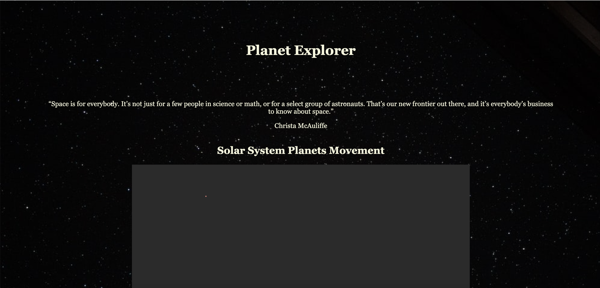

  	p5 animation of Solar System Planets Movement
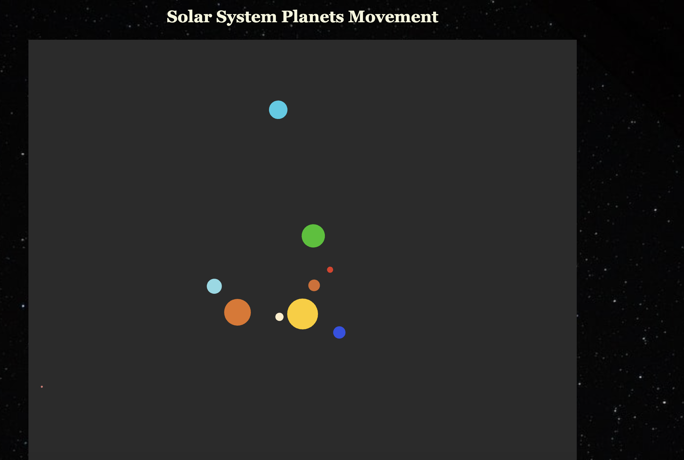
	
   	User interaction by selecting one of the planet names to make a data request about different planets
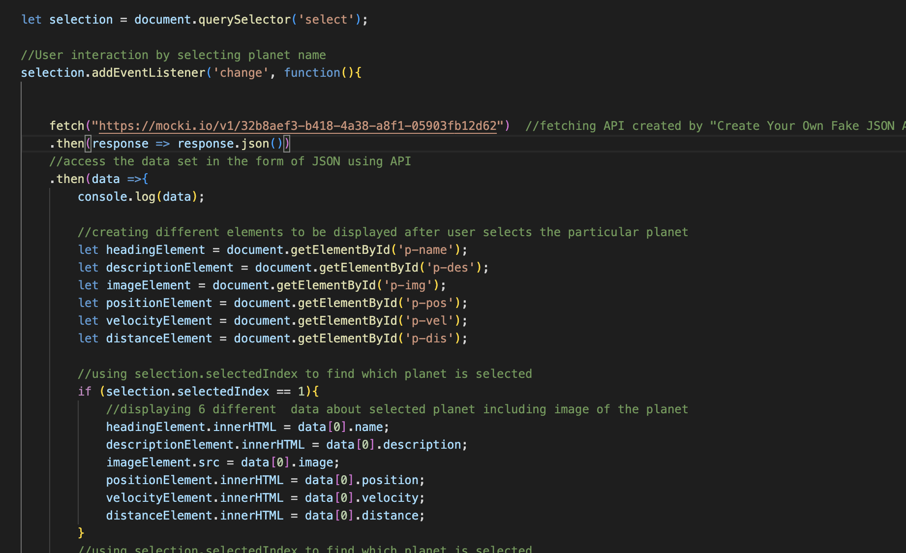	
	
   	Displaying data about specific planet selected by user
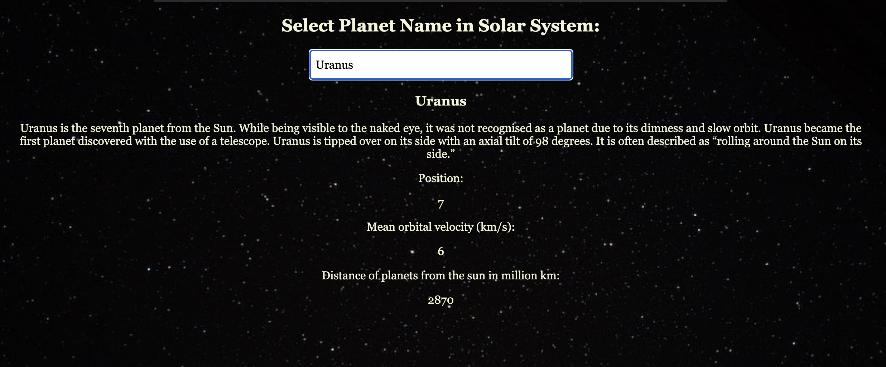
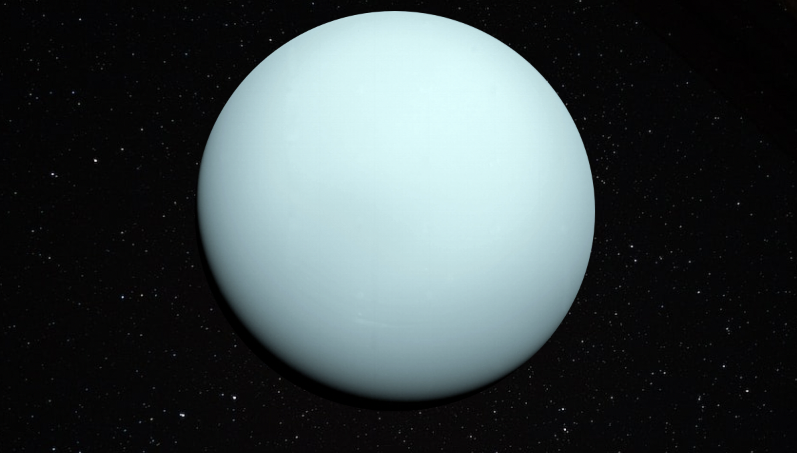
	
## What I learned from this Assignment?

With the help of this project, I learned a lot about API and JSON files. In practice, I used 

fetch("https://mocki.io/v1/32b8aef3-b418-4a38-a8f1-05903fb12d62")
    .then(response => response.json())
    .then(data =>{
        console.log(data);. 
        

to access the data set in the form of JSON using API I created using "Create Your Own Fake JSON API" https://mocki.io/fake-json-api website.
  
  I used one selection element to create  event-driven user interactions that are handled in a app.js file. When the user selects one of the planet names in the dropdown menu, it depicts one of the planets in our Solar System with a concise description. I also learned how to access and utilize data from JSON using specific IDs to manipuate different attributes. For example:
  
  let descriptionElement = document.getElementById('p-des');
  
  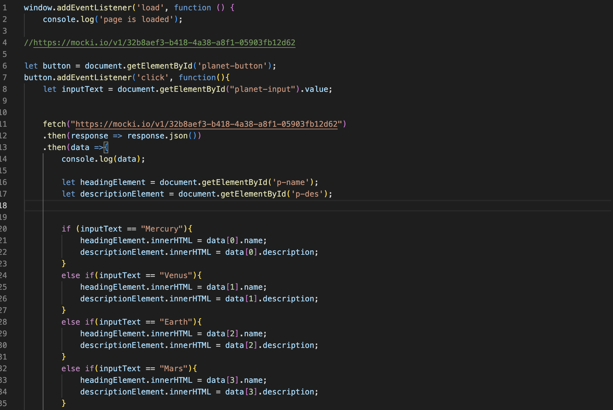
  
I wanted to improve the quality of the experience for an expected user so I implemented p5 animation of planet movements. 
  
  
## Challanges and Process of Creation
I had zero previous experience with web-development, and terms like JSON and API were somewhat distant to me. But through this hands-on practical project I was able to learn a lot about APIs and their use in web-development. Throughout the process of creation of Prototype 1, I had numerous challanges and difficulties. 
	
1) I could not find suitable API for my project because publicly available APIs did not have key attributes like Description, Images and some basic characteristics of the planet. Also some of them had too much redundant information which is not relavant for the averege-level user. For example https://api.le-systeme-solaire.net/en/. So I searched for a JSON file from the internet and used https://mocki.io/fake-json-api website to create my own API for this project.

2) In the class we discussed PokeAPI where you can freely access the data of each Pokemon by adding its name to the end of URL. For example, https://pokeapi.co/api/v2/pokemon/ditto. In my case because API did not have this kind of easy access to each planet data, so I had to use if condition to check the planet name and link it to the specific location of this planet on the array.

3) Implementation of p5 animation of planet movements was quite hard and additional functionality of selecting planet by mouse from the animation to display information is impossible because of specific p5 implementation issues and its negative effect on overall quality of the experience for an expected user.

## Code index.html
  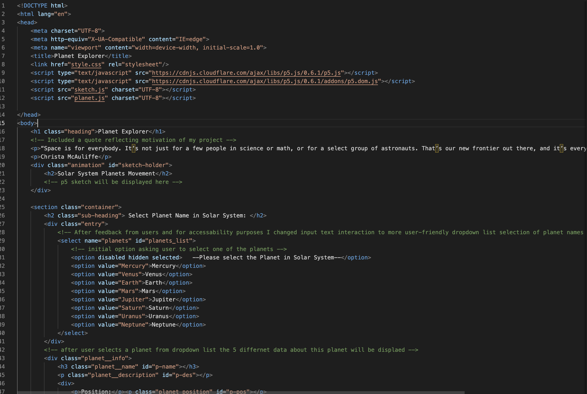
  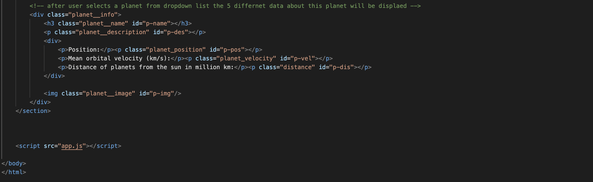
  
## Code script.js
  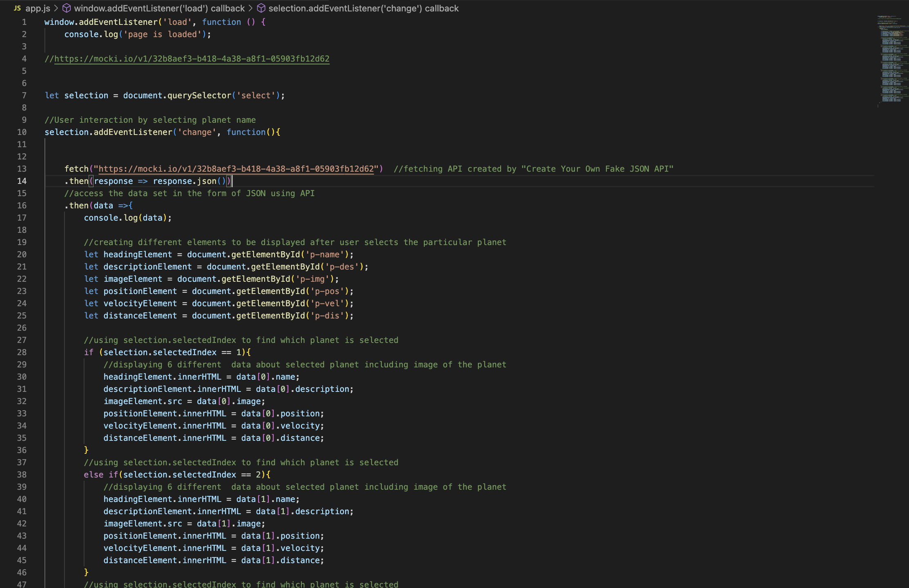
  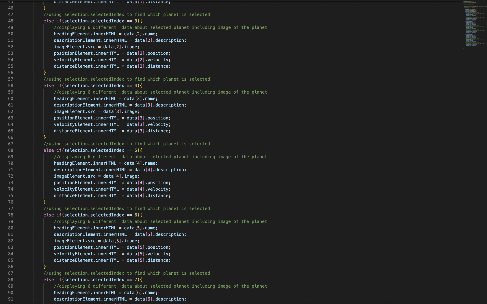
  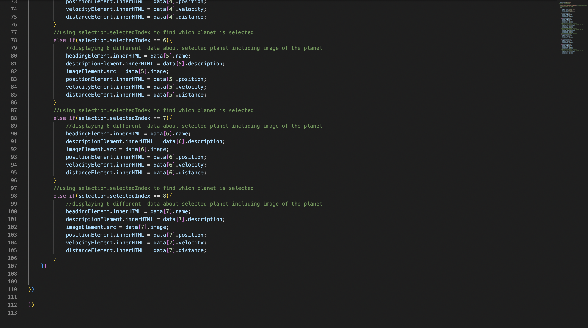
