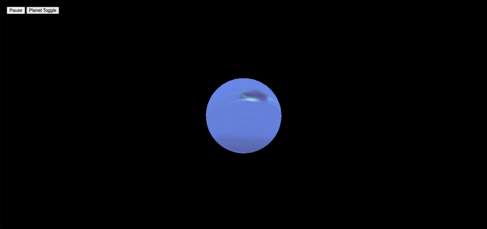
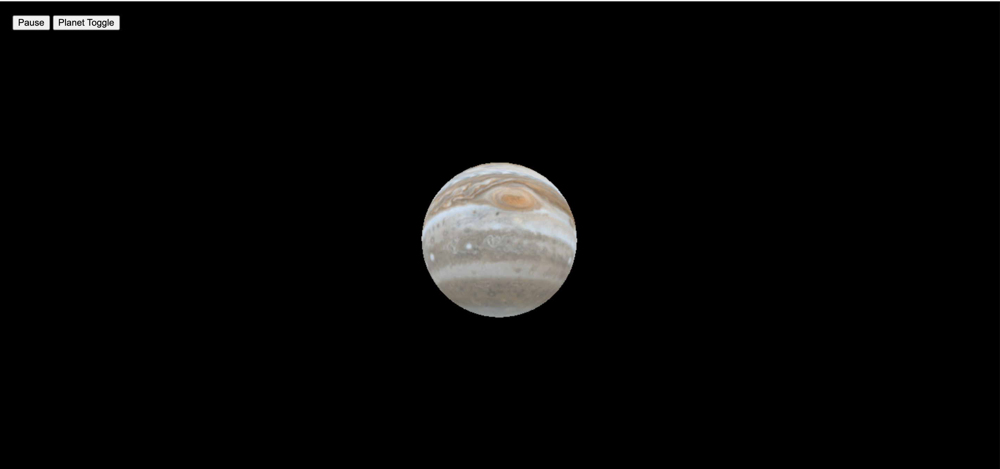
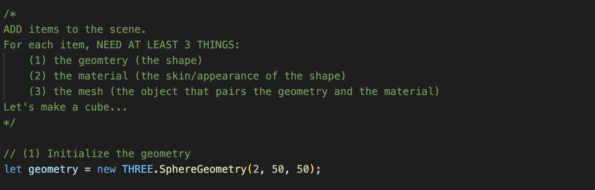

# Documentation of Three.js Planet Project

## Website link: https://aibartt.github.io/Connection_Lab_Aibar/Three.jsProject

## Project Concept & Idea
My idea was to create a Planet Explorer Website, where users can explore different planets in our Solar System. I implemented a 3D animation of 8 planets in solar sytem using Three.js client-side library. I borrowed the Three_Cube Project that we have seen in class and modified it. The website has two buttons Pause and Planet toggle, as the names suggest pause will pause the rotation of the planet and you could look in detail for the planet and Planet toggle button will display randomly selected planet in solar system.

## User Experience & Design

	
	
	

## What I learned from this Assignment?
In this assignment I learned the basics of Three.js client-side library and how to initialize it in pracitice.
I learned that we need to setup 3 crucial parts: 1)a scene 2)a camera 3)a renderer using the following line sof code: 
	
	//Create a scene
	const scene = new THREE.Scene();
	scene.background = new THREE.Color('black');

	//Create a camera
	const camera = new THREE.PerspectiveCamera(500, window.innerWidth/window.innerHeight, 0.1, 1000);
	camera.position.z = 3;

	//Create a renderer
	const renderer = new THREE.WebGLRenderer();
	renderer.setSize(window.innerWidth, window.innerHeight);
	
After that I fixed our mistake in SphereGeometry function in prev lesson. I found out that the geometry is created by sweeping and calculating vertexes around the Y axis (horizontal sweep) and the Z axis (vertical sweep). 

The general formula:
	#SphereGeometry(radius : Float, widthSegments : Integer, heightSegments : Integer, phiStart : Float, phiLength : Float, thetaStart : Float, thetaLength : Float)
	radius — sphere radius. Default is 1.
	widthSegments — number of horizontal segments. Minimum value is 3, and the default is 32.
	heightSegments — number of vertical segments. Minimum value is 2, and the default is 16.

Hence by increasing the widthSegments and heightSegments variables to value 50, I got the smoother sphere geometry instead of polygonic sphere.

   
